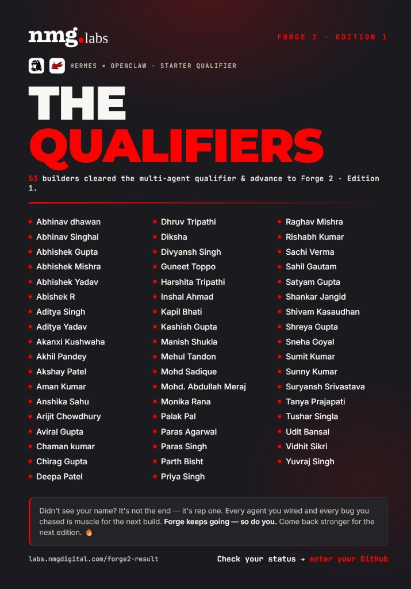

# Forge 2 Qualifier — Rebelroot Kanban

A two-agent AI system that built a Trello-style Kanban board. Built with **Hermes** (the brain 🧠) + **OpenClaw** (the hands 🖐️) wired through Slack.

---

### 🏆 TOP 50 QUALIFIED (PARAS AGARWAL) OUT OF 1000+
I, **Paras Agarwal** successfully cleared the multi-agent qualifier and advanced to **Forge 2 • Edition 1** (as one of only 53 builders globally to clear the qualifier out of 1,000+ applicants).

* 🔗 **Verification Link**: [labs.nmgdigital.com/forge2-result#parasxagarwal](https://labs.nmgdigital.com/forge2-result#parasxagarwal)

<p align="center">
  
</p>

---

**Live URL**: https://parasxagarwal.github.io/forge2-qualifier-moc/

## Project Overview

**Project Alpha** is a Trello-style Kanban board application built with a **Laravel 12** REST API (powered by SQLite) and a **React 19** frontend (powered by Vite).

The system features:
- **Board name**: Project Alpha
- **Tech stack**: Laravel API + React Vite + SQLite
- **Features**: Boards, Lists, Cards, Tags, Members, Due dates
- **Deployment**: Frontend hosted on GitHub Pages, Backend local + Serveo SSH tunnel

The default board contains 3 lists — **To Do**, **In Progress**, and **Done** — with sample cards demonstrating the Kanban workflow.

---

## Features

| Feature | Status | Description |
|---------|--------|-------------|
| **Boards → Lists → Cards** | ✅ Complete | Create, read, update, delete, and move cards between lists |
| **Card Details** | ✅ Complete | Edit card titles, descriptions, and metadata |
| **Tags / Labels** | ✅ Complete | Assign color-coded tags to categorize cards |
| **Members** | ✅ Complete | Assign workspace members to specific tasks |
| **Due Dates** | ✅ Complete | Set and track deadlines with visual indicators for overdue cards |

### Additional Details
- Drag-and-drop UI layout structure.
- Local email logging (configured via Laravel mail log driver).
- Commenting and activity tracking enabled through the API.

---

## Run Locally

### Prerequisites

- Node.js 22+
- PHP 8.2+ with Composer
- SQLite

### 1. Clone & Install

```bash
git clone https://github.com/ParasxAgarwal/forge2-qualifier-moc.git
cd forge2-qualifier-moc

# Backend Setup
cd backend
composer install
php artisan serve --port=8000

# Frontend Setup (in a new terminal window)
cd ../frontend
npm install
npm run dev
```

### 2. Configure Environment

Create the environment file for backend:
```bash
cp backend/.env.example backend/.env
php artisan key:generate
```

Configure the API URL for the frontend. Create/edit `frontend/.env.production` (or `frontend/.env`):
```env
VITE_API_URL=http://localhost:8000/api
```

### 3. Seed the Database

```bash
cd backend
php artisan migrate:fresh --seed --force
```

### 4. Access the Application

Open your browser to:
- Frontend Development Server: `http://localhost:5173/forge2-qualifier-moc/`
- Frontend Production Preview: `http://localhost:4173/forge2-qualifier-moc/`

---

## Repo Structure

```
├── backend/            # Laravel API
│   └── database/seeders/DatabaseSeeder.php
├── frontend/           # React + Vite
│   └── vite.config.js (base: /forge2-qualifier-moc/)
├── slack-export/       # Slack conversation & run screenshots (evidence)
├── openclaw.json       # OpenClaw configuration file
├── hermes-config.yaml  # Hermes configuration file
├── README.md           # Project Documentation
├── ARCHITECTURE.md     # Architecture documentation
└── docs/               # GitHub Pages build (dist/)
```

---

## Video Walkthrough & Proof of Work

* 📹 **Screen Recording (Video Proof)**: [Watch the Walkthrough video (Vercel Storage)](https://1i81vatywd5bjk3l.public.blob.vercel-storage.com/FORGE/Screen%20Recording%202026-06-21%20at%205.12.14%E2%80%AFPM.mov)
* 📸 **Execution Screenshot**: [View the screenshot proof (Vercel Storage)](https://1i81vatywd5bjk3l.public.blob.vercel-storage.com/FORGE/Screenshot%202026-06-21%20at%205.04.00%E2%80%AFPM.png)

---
